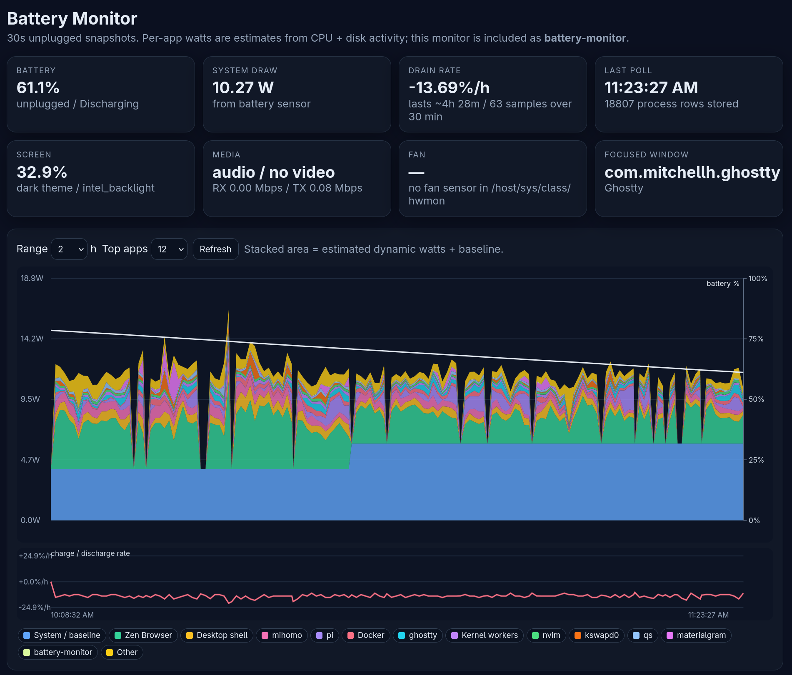

# Battery Monitor



Low-overhead Bun service that records laptop battery discharge snapshots and estimates which apps/processes are responsible. It serves a local interactive stacked chart.

## Run

```bash
cd /home/user/workspace/bms/devices/battery-monitor
docker compose -f compose.yml up -d --build
```

Open: <http://127.0.0.1:3033>

## What it does

- Polls every **30 seconds** (`POLL_INTERVAL_SECONDS=30`).
- Always stores a small battery sample.
- Stores process snapshots only when unplugged by default (`RECORD_WHEN_PLUGGED=false`).
- Reads host battery data from `/sys/class/power_supply` via a read-only `/sys` mount.
- Reads host process data from `/proc` with `pid: host`.
- Includes its own Bun process as `battery-monitor` so you can verify it stays cheap.
- Groups related helper processes under app families, e.g. Zen web content/extensions under `Zen Browser`, and container descendants under `Docker`.
- Has a `Groups` tab with aggregated per-group usage and expandable subprocess contribution.
- Shows focused-window history as a compact timeline strip; hover reveals the title at that moment. Sleep gaps do not show stale focused windows.
- Tracks lid closed state and common lock-screen processes while the machine is awake.
- Shows brightness/theme and video-streaming timeline mini charts with detailed hover context.
- Time labels are frontend-configurable; default display timezone is UTC+3 and can be changed in the toolbar.
- Keeps an explicit adaptive `System / baseline` row so idle/platform watts are not blamed on apps.
- Captures screen/theme/media context: brightness, light/dark theme, fan RPM when exposed by the kernel, audio playback state, network rate, probable browser video streaming, and optional focused-window metadata.
- Detects suspend/sample gaps, estimates average battery loss or charge during sleep, and renders gap bands without connecting process usage across sleep.

Per-group watts are estimates from process samples. Linux exposes total battery draw, not exact watts per PID/tab, so the monitor attributes dynamic power from CPU time + disk I/O deltas.

## Low-drain choices

- Single Bun process, no frontend framework, no background workers.
- 30s polling interval.
- SQLite writes once per poll.
- No eBPF/perf/GPU polling by default.
- Docker limits: `cpus: 0.25`, `mem_limit: 128m`.
- Process rows are skipped while plugged unless configured otherwise.

## Configuration

Important environment variables in `compose.yml`:

| Variable | Default | Meaning |
|---|---:|---|
| `POLL_INTERVAL_SECONDS` | `30` | Poll interval. |
| `RECORD_WHEN_PLUGGED` | `false` | Also store process snapshots when AC is connected. |
| `BASELINE_MODE` | `adaptive` | Uses lowest recent discharge draw as baseline, clamped below. Use another value for fixed `BASELINE_WATTS`. |
| `BASELINE_WATTS` | `4` | Fixed fallback baseline watts. |
| `BASELINE_MIN_WATTS` | `2` | Adaptive baseline lower clamp. |
| `BASELINE_MAX_WATTS` | `6` | Adaptive baseline upper clamp. |
| `HOST_CONFIG_DIR` | `/host/config` | Read-only mounted desktop config for light/dark theme detection. |
| `FOCUSED_WINDOW_FILE` | `/data/focused-window.json` | Read focused-window JSON written by optional host helper. |
| `SUSPEND_GAP_SECONDS` | `120` | Treat longer sample gaps as suspend/gap events and estimate average sleep consumption. |
| `VIDEO_RX_MBPS_THRESHOLD` | `1` | Browser video-stream heuristic network RX threshold. |
| `MAX_PROCESSES_PER_SAMPLE` | `0` | `0` stores all active processes; positive value stores top N plus self. |
| `RETENTION_DAYS` | `14` | Deletes older samples hourly. |
| `FORCE_COLLECT` | `false` | Useful on desktops or for testing without battery. |

## System helper

Wayland/session state is not exposed cleanly to containers. For niri, run the host-side system helper in your user session:

```bash
cd /home/user/workspace/bms/devices/battery-monitor
./scripts/battery-monitor-system-helper.sh
```

It writes small JSON files such as `data/focused-window.json` and `data/desktop-state.json`; the Docker service imports them on the next poll. The desktop state also includes host audio stream metadata used by the video-streaming heuristic.

To auto-start it on login, install the user systemd service:

```bash
./scripts/install-system-helper-service.sh
```

Useful commands:

```bash
systemctl --user status battery-monitor-system-helper.service
systemctl --user restart battery-monitor-system-helper.service
systemctl --user disable --now battery-monitor-system-helper.service
```

## Data

SQLite database is stored at:

```text
./data/battery-monitor.sqlite
```

Tables:

- `battery_samples`
- `process_samples` legacy denormalized rows, pruned by retention
- `process_identities` process/app/cmd text stored once
- `process_samples_v2` compact per-sample numeric process rows
- `sample_app_totals` pre-aggregated app watts per sample for fast timeline queries
- `sample_process_totals` pre-aggregated process identity totals per sample
- `sample_group_totals` pre-aggregated expandable group/subprocess totals for faster Groups view
- `environment_samples`
- `sleep_events` suspend/sample gap intervals with average sleep charge/discharge rate

## Native development

```bash
cd /home/user/workspace/bms/devices/battery-monitor
bun run check
PORT=13030 FORCE_COLLECT=true POLL_INTERVAL_SECONDS=5 bun run start
```
